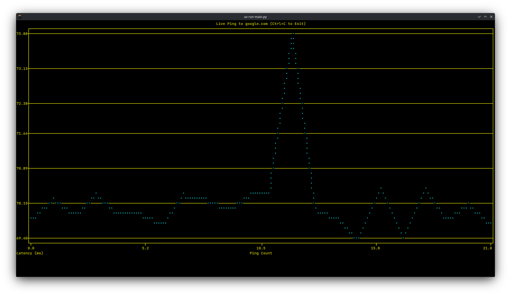

# Pingy

A real-time, zero-overhead Terminal User Interface (TUI) ping latency visualizer built in Python and powered by `uv`. 

No bulky desktop GUI windows or root privilege requirements—just clean, live performance graphing right inside your terminal cell grid.



## Features

- **TUI Architecture:** Renders fluid line graphs directly inside your terminal window using standard characters.
- **Rootless Operation:** Leverages modern OS user-space datagram sockets, avoiding dangerous `sudo` or root execution requirements.
- **Live Moving Canvas:** Automatically scales and scrolls across a rolling 30-ping history window.
- **Visual Failure Indicators:** Instantly spikes the plot to indicate packet loss or network dropouts.

## Prerequisites

This project relies on **`uv`**, the ultra-fast Python package resolver and toolchain installer. If you don't have it installed, get it via:

```bash
# macOS/Linux
curl -LsSf https://astral.sh | sh

# Windows
powershell -c "irm https://astral.sh | iex"
```

## Quick Start

Getting the utility running takes less than a minute:

1. **Clone the Repository**
   ```bash
   git clone https://github.com/astrosteveo/pingy
   cd pingy
   ```

2. **Run Instantly**
   Using `uv run`, dependencies are automatically synced into an isolated environment and launched:
   ```bash
   uv run pingy
   ```

## Linux Environment Troubleshooting

On some strict Linux distributions, unprivileged user accounts are blocked from opening ICMP sockets by default. If you see a socket permissions error when running the app, execute this standard command to grant your user group ping permissions:

```bash
sudo sysctl -w net.ipv4.ping_group_range="0 2147483647"
```

To make this change permanent across reboots, append the following line to your `/etc/sysctl.conf` file:
```text
net.ipv4.ping_group_range = 0 2147483647
```

## License

Distributed under the MIT License. See `LICENSE` for more information.
